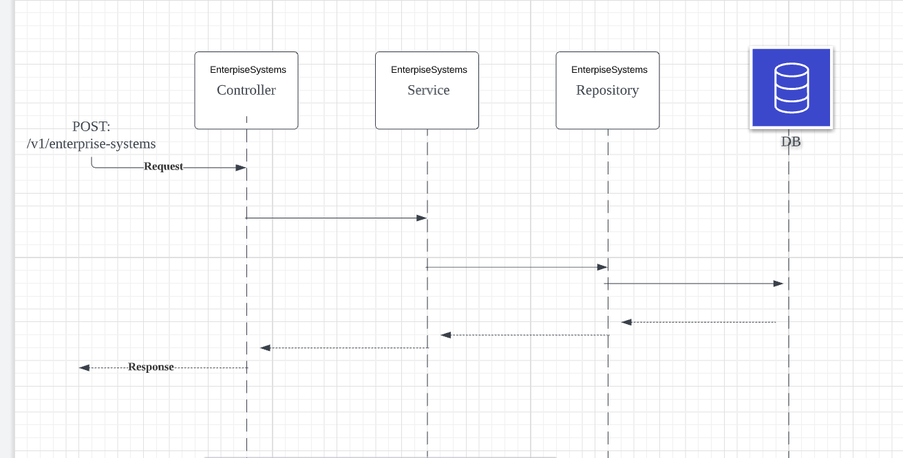

in command line run:

Command: mvn clean install
Command: mvn spring-boot:run
Output:

```
server.port=8080

#http://localhost:8080/v3/api-docs.yaml
#http://localhost:8080/v3/api-docs/
#http://localhost:8080/swagger-ui/index.html



